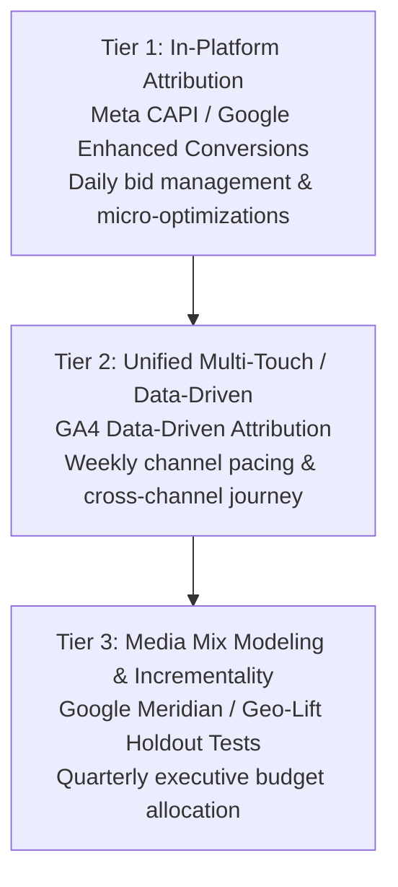

# Modern Attribution, Media Mix Modeling (MMM) & Incrementality
# Scope: Post-Cookie Attribution, Google Meridian, Geo-Lift Testing

## 1. The Modern Attribution Challenge
Relying strictly on last-click attribution creates severe media misallocation:
- Over-credits lower-funnel channels (Brand Search, Retargeting).
- Starves upper-funnel and discovery channels (Meta Prospecting, YouTube, Demand Gen).
- Signal degradation from iOS ATT, ad blockers, and consent banners causes up to 40% loss in deterministic tracking.

---

## 2. The 3-Tier Measurement Hierarchy

To make sound budget allocation decisions, use three complementary layers:

---

## 3. Media Mix Modeling (MMM) Framework

### Google Meridian & Open-Source MMM
MMM uses top-down time-series econometrics (Spend vs Conversions across markets over 24+ months) without requiring user-level cookies or PII.

### Key Parameters:
1. **Adstock & Decay**: Measures the carryover effect of ad impressions over time.
   - Fast decay: Search ads (carryover 1–3 days).
   - Slow decay: Brand video / TV / podcast (carryover 14–45 days).
2. **Diminishing Returns (Hill Curve)**: Identifies the saturation point where additional spend produces marginal incremental revenue.
3. **Macro Controls**: Account for seasonality, inflation, promotions, competitor actions, and macroeconomic trends.

---

## 4. Incrementality & Geo-Lift Testing Protocol

Never assume reported ROAS represents true net-new revenue. Run scheduled incrementality tests:

### Geo-Lift Test Blueprint:
1. **Market Pairing**: Select 20 comparable geographic territories (e.g., pairs of metro areas with matched historical sales trends).
2. **Split**: Assign 10 test markets (Ad spend increased by 50%) and 10 control markets (Ad spend held flat or zeroed).
3. **Duration**: 4 to 6 weeks test period + 2 weeks cooldown.
4. **Equation**:
   $$\text{Incremental ROAS (iROAS)} = \frac{\Delta \text{Revenue}_{\text{Test}} - \Delta \text{Revenue}_{\text{Control}}}{\text{Incremental Ad Spend}}$$
5. **Decision Rule**: If iROAS is below breakeven threshold, reallocate spend to higher-incrementality channels even if in-platform reported ROAS appears high.
