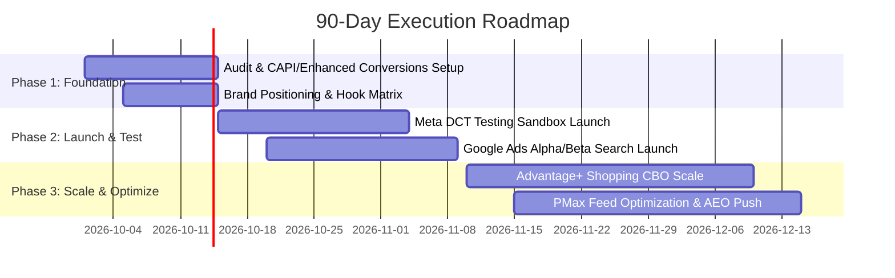

# Digital Marketing Strategy & Growth Proposal

**Client:** {{client_name}}  
**Prepared By:** Techno Exponent / Digital Marketing Team  
**Date:** {{date}}  
**Version:** 1.0 (Validated Framework)

---

## 1. Executive Summary

This proposal presents a data-driven, full-funnel digital marketing strategy designed to scale **{{client_name}}**'s customer acquisition, lower blended CAC, and maximize qualified conversion volume over the next 90 days.

### Key Objectives:
- **Primary Goal**: Scale monthly acquisition to **{{target_conversions}}** while maintaining Target CPA below **{{target_cpa}}**.
- **Efficiency Target**: Achieve a minimum blended ROAS of **{{target_roas}}** across all paid channels.
- **Organic & Generative Visibility**: Establish brand dominance across classical organic search and modern AI search engines (Google AI Mode, Perplexity).

---

## 2. Situation Analysis & Growth Audit

### Current Baseline Metrics:
- **Monthly Revenue / Inquiries**: {{current_revenue_or_leads}}
- **Current Blended CPA**: {{current_cpa}}
- **Key Bottlenecks Identified**:
  1. *Audience Fatigue & High Frequency*: Lack of automated dynamic testing to refresh creatives.
  2. *Attribution & Tracking Leaks*: Missing server-side tracking (CAPI) leading to underreported conversions.
  3. *Brand Cannibalization*: Generic ad spend overlapping with brand search terms.

---

## 3. The 90-Day Strategic Roadmap

---

## 4. Channel Architecture & Budget Split (70/20/10)

| Channel | Focus Area | Monthly Budget | % of Spend | Primary KPI |
| :--- | :--- | :--- | :--- | :--- |
| **Meta Ads (ASC & DCT)** | TOF Prospecting + Creative Testing | {{meta_budget}} | 60% | Purchases / CPA |
| **Google Ads (Search & PMax)** | High-Intent Capture + Brand Defense | {{google_budget}} | 30% | Conversion Rate / ROAS |
| **Lifecycle & Retention** | Abandoned Cart Flows & VIP Win-Back | {{email_budget}} | 10% | Repeat Purchase Rate |

---

## 5. Creative Execution Matrix (Hook-Hold-Offer)

All creative assets follow our validated 3-stage performance blueprint:

1. **0–3s Hook**: Stop-the-scroll visual disruption and headline problem statement.
2. **3–15s Hold**: Mechanism of action, proof points, third-party lab verification, or customer demonstration.
3. **15–30s Offer**: Low-friction call to action, bundle savings, guarantee, and urgency.

---

## 6. Commercial Terms & Engagement Sign-Off

- **Retainer / Management Fee**: {{management_fee}}
- **Reporting Cadence**: Weekly live dashboard pacing review + Monthly executive summary.
- **Compliance Guarantee**: All campaigns deployed in `PAUSED` status; all creative signed with C2PA provenance and EU AI Act disclosures.
